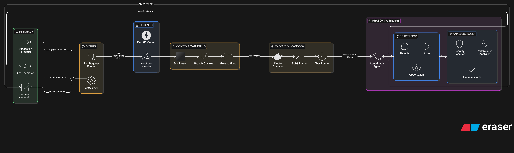

'''text
pr-review-agent/
├── .github/
│   └── workflows/
│       ├── ci.yml               # lint + test on every push
│       ├── deploy.yml           # build & push Docker image on main
│       └── pr-agent-check.yml   # meta: runs the agent on its own PRs
│
├── src/
│   ├── listener/
│   │   ├── __init__.py
│   │   ├── app.py               # FastAPI entrypoint
│   │   ├── webhook.py           # HMAC validation, event routing
│   │   └── schemas.py           # Pydantic models for GH payloads
│   │
│   ├── agent/
│   │   ├── __init__.py
│   │   ├── graph.py             # LangGraph state machine
│   │   ├── state.py             # AgentState dataclass
│   │   ├── nodes.py             # think / act / observe node fns
│   │   └── prompts.py           # system + ReAct prompt templates
│   │
│   ├── tools/
│   │   ├── __init__.py
│   │   ├── codebase_search.py   # grep over collected context
│   │   ├── semgrep_scan.py      # security + secret detection
│   │   ├── complexity.py        # Big-O estimation tool
│   │   └── sandbox.py           # E2B build + test runner
│   │
│   ├── github/
│   │   ├── __init__.py
│   │   ├── context.py           # collect diff + related files
│   │   ├── comments.py          # post inline suggestion blocks
│   │   └── fix_branch.py        # push ai-fix-{pr} commits
│   │
│   └── config.py                # settings via pydantic-settings
│
├── tests/
│   ├── unit/
│   │   ├── test_webhook.py
│   │   ├── test_tools.py
│   │   └── test_context.py
│   ├── integration/
│   │   └── test_agent_flow.py   # mocked E2B + GH API
│   └── fixtures/
│       ├── sample_payload.json
│       └── sample_diff.patch
│
├── Dockerfile
├── docker-compose.yml           # local dev: app + ngrok for webhooks
├── docker-compose.test.yml      # isolated test environment
├── pyproject.toml               # deps via uv/poetry
├── .env.example
└── README.md
'''

