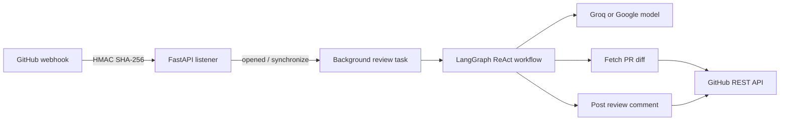

# Code Review Agent

An event driven AI service that reviews GitHub pull requests with a bounded LangGraph workflow and GitHub REST tools.

[](https://github.com/mariamneffeti/code_review_agent/actions/workflows/ci.yml)


## Demo

<!-- Add the demo GIF at docs/demo.gif when it is ready. -->


## Features

- FastAPI webhook listener with GitHub SHA-256 signature verification.
- Routes pull request `opened` and `synchronize` events to a background review task.
- LangGraph ReAct loop with a configurable iteration limit.
- GitHub REST tools to fetch a pull request diff and post a review comment.
- LLM provider selection through Groq or Google API credentials.
- Mocked HTTP and model tests that make no real API calls.

## Architecture


```mermaid
flowchart LR
    GH[GitHub webhook] -->|HMAC SHA-256| API[FastAPI listener]
    API -->|opened / synchronize| BG[Background review task]
    BG --> G[LangGraph ReAct workflow]
    G --> LLM[Groq or Google model]
    G --> DIFF[Fetch PR diff]
    G --> COMMENT[Post review comment]
    DIFF --> REST[GitHub REST API]
    COMMENT --> REST
```

## Stack

- Python 3.11+, FastAPI, Pydantic Settings
- LangGraph and LangChain provider integrations (Groq, Google Generative AI)
- httpx for GitHub REST requests
- pytest, pytest-asyncio, Ruff, Docker Compose

## Quickstart

Docker is the recommended local setup.

```bash
cp .env.example .env
# Edit .env and set WEBHOOK_SECRET plus GITHUB_TOKEN and one model API key.
docker compose up --build app
```

The API will be available at `http://localhost:8000`; check `http://localhost:8000/health`.
The `ngrok` service is included for webhook delivery from GitHub. Set `NGROK_AUTHTOKEN` in your shell or `.env`, then run `docker compose up ngrok`.

To run the app directly instead:

```bash
python -m pip install -e ".[test]"
uvicorn src.listener.app:app --reload
```

## Configuration

Copy [.env.example](.env.example) to `.env` and fill in the values:

| Variable | Purpose |
| --- | --- |
| `GITHUB_TOKEN` | Token with permission to read pull requests and create issue comments |
| `GROQ_API_KEY` | Groq model credential; preferred when both provider keys are set |
| `GOOGLE_API_KEY` | Google Generative AI credential used when the Groq key is empty |
| `WEBHOOK_SECRET` | Shared secret configured for the GitHub webhook |
| `MAX_ITERATIONS` | Maximum think/act/observe cycles per review (default: `5`) |

## Testing

The tests mock the LLM and HTTP responses; they do not contact GitHub or a model provider.

```bash
python -m pip install -e ".[test]"
pytest -q
```

To run them in the isolated container:

```bash
docker compose -f docker-compose.test.yml run --rm test-runner
```

## Project structure

```text
src/
├── listener/   # FastAPI app, webhook verification, GitHub payload schemas
├── agent/      # AgentState, prompts, ReAct nodes, LangGraph workflow
├── tools/      # GitHub API and analysis tools
├── github/     # GitHub context, comments, and branch helpers
└── config.py   # Environment-backed settings
tests/
├── unit/       # Listener and tool tests
├── integration/# Mocked graph workflow tests
└── fixtures/   # Sample webhook and diff data
```

## Key technical decisions

- Verify the HMAC against the raw request body before parsing JSON, as required by GitHub's webhook signature scheme.
- Use FastAPI background tasks so webhook acknowledgement does not wait for a review to finish.
- Keep model and tool functions injectable in the graph for deterministic, offline tests.
- Bound each agent run with `MAX_ITERATIONS` to prevent unbounded model/tool loops.
- Keep GitHub API access behind small functions with typed parameters and explicit error reporting.

## Roadmap

- Add inline review annotations tied to changed file lines.
- Add richer repository context retrieval and review configuration.
- Add operational metrics and structured review logs.
- Add a real webhook-to-review demo GIF.

## License

No license has been selected for this repository yet. Add the chosen license before granting reuse rights.

## Contact

Open an issue in [this repository](https://github.com/mariamneffeti/code_review_agent) for questions or feedback.
